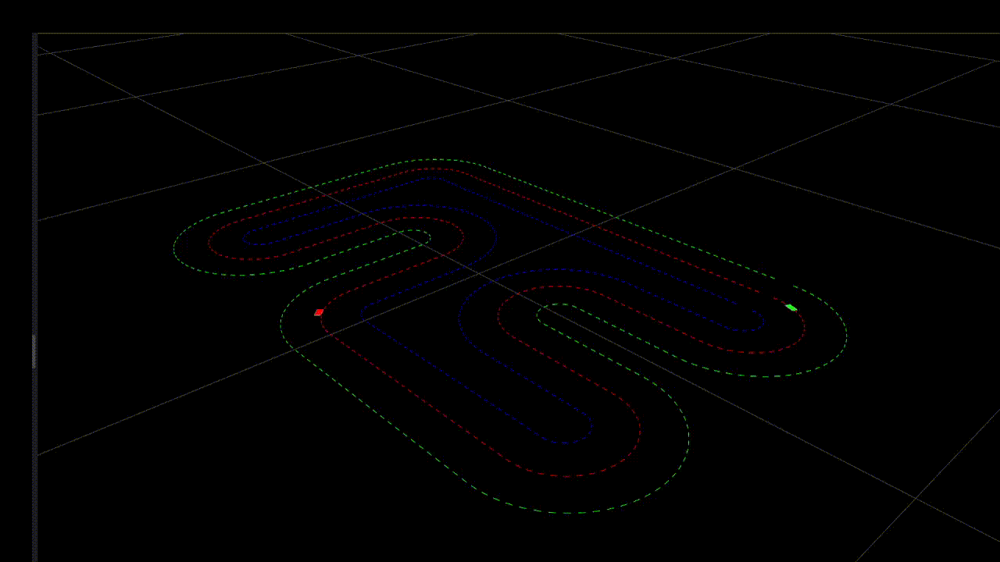

# Model Predictive Contouring Control
Implementation of Model Predictive Contour Control for Autonmous Car in Python with obstacle Avoidance
- Dependencies : Python,CASadi,MatPlotLib

  
*▲ Green box is the ego Vehicle , Red is the obstacle ;white dashed lines are the prediction of the planner , red dashed : Reference Trajectory to track*

