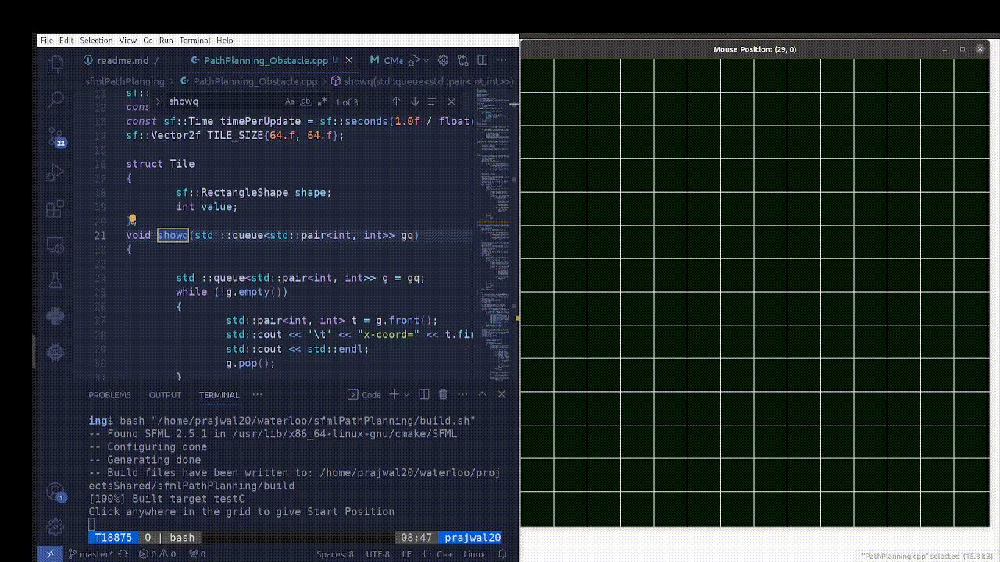

# Path-Planning and Visualization in SFML
1. Dependencies : [SFML](https://github.com/SFML/SFML)

##### To run:
1. run the build.sh file ; it will compile the c++ file and then will run it
    1. In linux :
    2. chmod +x build.sh
    3. ./build.sh
    

  
*▲ BFS PAth Planning ; green:start position white:goal Position ;red:obstacles;blue:The path created by BFS;Orange:Visited cell*

